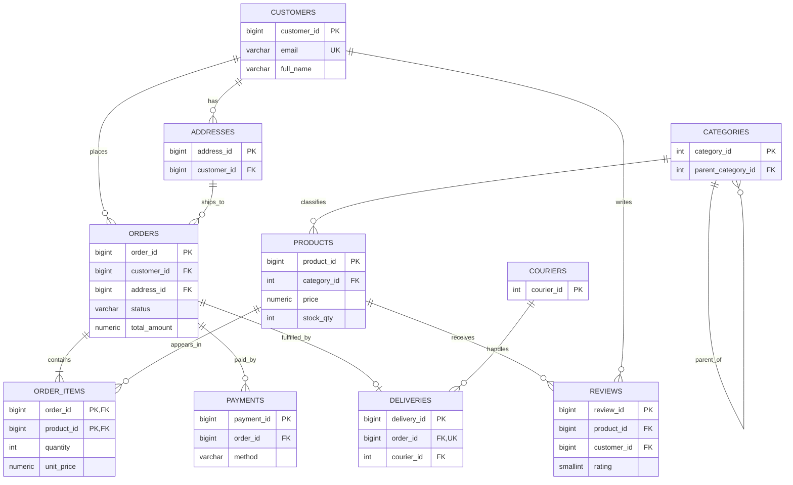

```mermaid
erDiagram
    CUSTOMERS ||--o{ ADDRESSES : has
    CUSTOMERS ||--o{ ORDERS : places
    ADDRESSES ||--o{ ORDERS : ships_to
    CATEGORIES ||--o{ CATEGORIES : parent_of
    CATEGORIES ||--o{ PRODUCTS : classifies
    ORDERS ||--|{ ORDER_ITEMS : contains
    PRODUCTS ||--o{ ORDER_ITEMS : appears_in
    ORDERS ||--o{ PAYMENTS : paid_by
    ORDERS ||--o| DELIVERIES : fulfilled_by
    COURIERS ||--o{ DELIVERIES : handles
    PRODUCTS ||--o{ REVIEWS : receives
    CUSTOMERS ||--o{ REVIEWS : writes

    CUSTOMERS { bigint customer_id PK
                varchar email UK
                varchar full_name }
    ADDRESSES { bigint address_id PK
                bigint customer_id FK }
    CATEGORIES { int category_id PK
                 int parent_category_id FK }
    PRODUCTS { bigint product_id PK
               int category_id FK
               numeric price
               int stock_qty }
    ORDERS { bigint order_id PK
             bigint customer_id FK
             bigint address_id FK
             varchar status
             numeric total_amount }
    ORDER_ITEMS { bigint order_id PK,FK
                  bigint product_id PK,FK
                  int quantity
                  numeric unit_price }
    PAYMENTS { bigint payment_id PK
               bigint order_id FK
               varchar method }
    COURIERS { int courier_id PK }
    DELIVERIES { bigint delivery_id PK
                 bigint order_id FK,UK
                 int courier_id FK }
    REVIEWS { bigint review_id PK
              bigint product_id FK
              bigint customer_id FK
              smallint rating }
```
